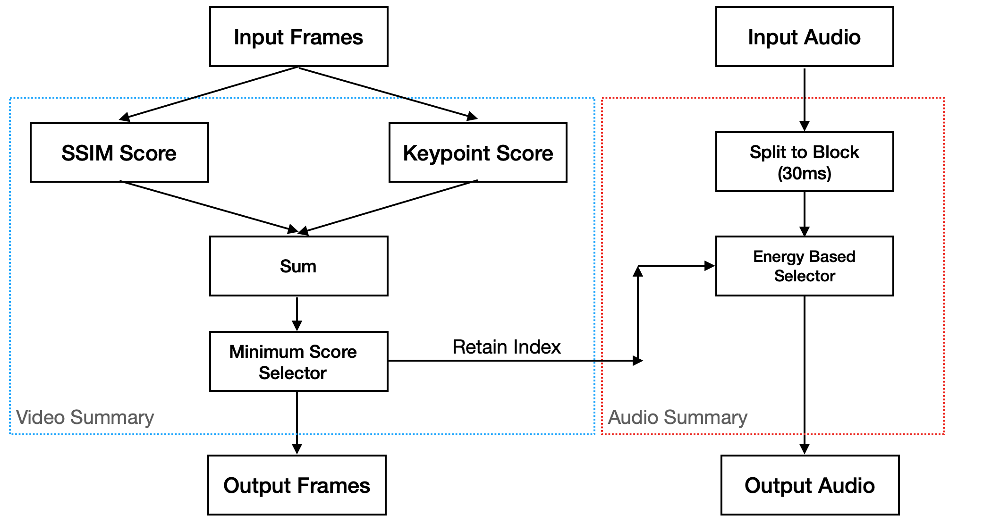
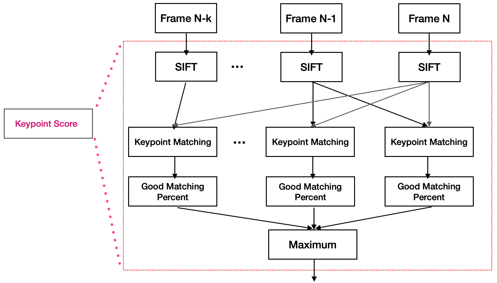

## Video and Audio Summary
#### 2021.04
#### @yifan
***
### Video Player --> `player.py`
1. load several frames into a buffer and init the `error=0`;
2. start to play the audio;
3. use `cv2.imshow()` and `cv2.waitkey(1)` show the image;
4. remove the shown frame out of the buffer and try to load new images to buffer; 
5. step 3 & 4 spend `t` and  `t+error` is less than `1/fps`;
    1. use the while loop to control the `1/fps-(t+error)` time delay;
    2. update `error=0`
6. if `t+error` is larger than `1/fps`; 
    1. continue to show next frame;
    2. update error as `t+error-1/fps`;

The step 5 & 6 helps to avoid the error accumulation; If the previous frame use too much time, current and future several frames would show less time to compensate the error;

Input fps and image size affect the player, for large fps and large size, the play may not work well;
```python
player(frames_path,     # frames path
       audio_path,      # audio path
       fps,             # frame rate
       size=None)       # need resize is not None
```
***
### Video Summary Pipeline


First, perform the video summary based on `SSIM Score` and `Keypoint Score` (introduce later) to get an embedding score (sum them up) and select the K frames with the smallest score. Correspondingly we can derive the bool set which indicates whether a frame is retained;

The audio summary is based on the summary result of the video, given the bool index of video summary result;
1. Split the audio into blocks, each block has the same time range each frame;
2. If from frame i to frame i+k, only 1 frame is retained, we check the mean absolute magnitude of the each block;
3. Only retain the one with the largest mean absolute magnitude;

***
### MS-SSIM Score

1. Compute the MS-SSIM score for each image with its neighbour frames;
    1. original filter size is 11 which is modified to 23 in this case;
    2. in the experiments, calculate the MS-SSIM score with its' 4 previous neighbours;
2. Select the maximum MS-SSIM score (range from 0 to 1) to represent the overlapping with the previous frames;

***
### Keypoint Score


1. For each frame, detect key points and compute the corresponding descriptor;
    1. ORB and SIFT keypoint detectors are used;
    2. ORB with BRIEF descriptor would run faster than SIFT while less accurate;
    3. SIFT can have a matching selection process based on the descriptor distance;
2. Perform keypoint matching using the current frame's descriptor with the previous frames;
    1. To speed up the process, only match the current frame with 4 previous frames;
    2. SIFT with matching point selection is used (better than ORB);
3. For each matching, compute a matching percentage $\frac{\#good-match}{\#keypoint}$;
    1. Normalize to [0,1] better comparison, otherwise some frame with fewer key points may always discard;
    2. Easy embedding with MS-SSIM score;
    3. For each image, we will get 4 matching score, choose the largest one to represent this image;

***
### Segmentation based

1. Generate the segmentation mask for each frame using a ResNet-101 based framework;
    1. The net is pre-trained on Pascal Voc dataset;
2. Calculate the IoU between one frame and its neighbour;
    1. For Pascal Voc there are 21 classes including one unknown and one background;
    2. For computing the IoU, background class are ignored;
3. A maximum IoU score is used to represent the frame;
4. Using the ResNet-101 is pretty time consuming, each frame need 7s on my PC to get a segmentation mask;
    1. `this metric is not included in the pipeline because of time`;

***
### Usage
the main function is in `video_sum.ipynb`
```python
run(name='test',            # Sequence frame folder name (under ./data/)
                            # the frame must named from 0.jpg to *.jpg
    keeprate=90/540,        # keep rate
    fps=30,                 # framerate
    n_frames=-1,            # number of frames (if -1, it will check automatically)
    clean=True,             # clean the ./cache folder
    HR=True,                # using high resolution images (slower, but accurate)
                            # high resolution image is under './data/"$name"_hr
    israw=False,            # input is raw format
    raw_par={'folder':'test',   # raw format loaction 
             'H':352,           # raw format Height 
             'W':288,           # raw format Width      
             'prefix':'Image'}) # raw format prefix
```

